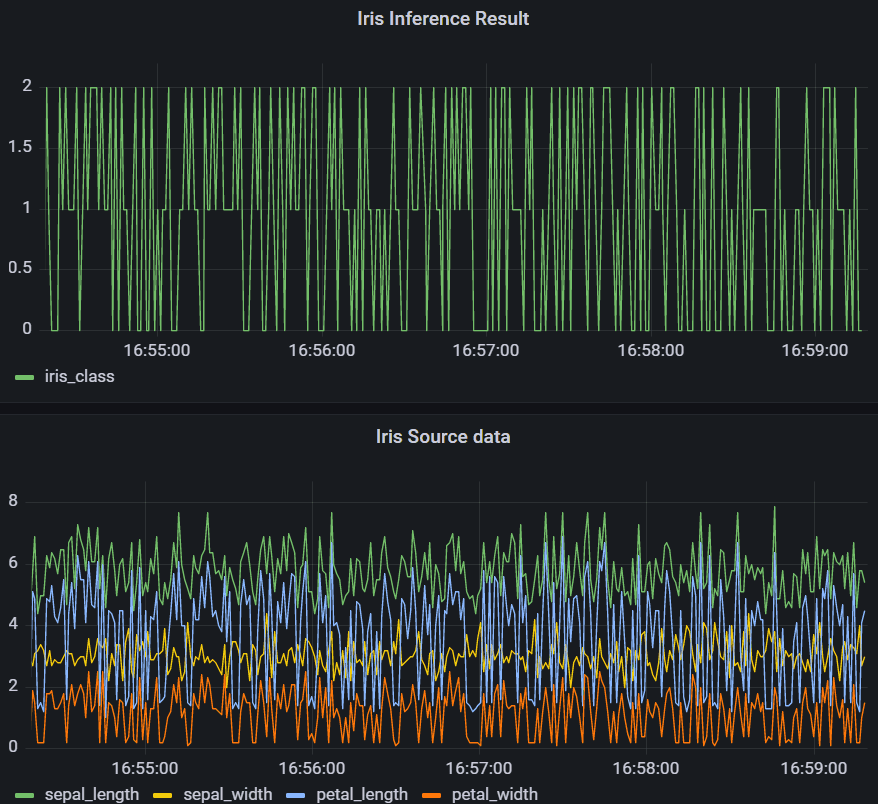

# MLops for MLEngineer
- [ML 엔지니어를 위한 MLops 튜토리얼](https://mlops-for-mle.github.io/tutorial/)의 실습 내용입니다.
  - 실습 환경 : Ubuntu 22.04.1 (WSL) 

- 각 챕터의 상세 내용 : [TIL](https://github.com/dowrave/TIL/tree/main/FromObsidian/%EA%B3%B5%EB%B6%80%20%EB%A9%94%EB%AA%A8/data%20science/MLOps/mlflow%20-%20ML%EC%97%94%EC%A7%80%EB%8B%88%EC%96%B4%EB%A5%BC%20%EC%9C%84%ED%95%9C%20MLOps) (Obsidian으로 작성되었음)
---
- 8장까지 완료 결과물
 

- 전체 구성

